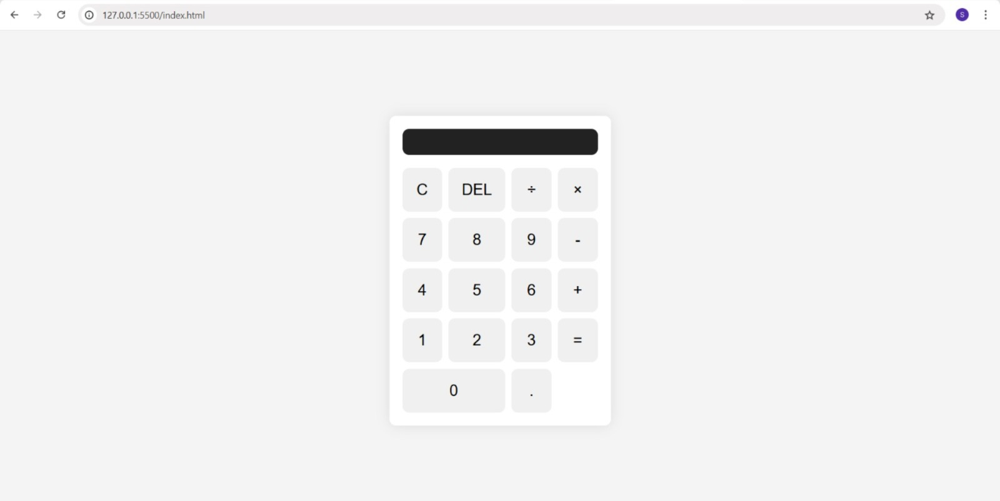

# 🧮 Basic Calculator

A simple calculator built using **HTML, CSS, and JavaScript** that performs basic arithmetic operations.




## 🚀 Features

* Addition (`+`)
* Subtraction (`-`)
* Multiplication (`×`)
* Division (`÷`)
* Decimal number support (`.`)
* Clear all (`C`)
* Delete last character (`DEL`)
* Responsive and clean user interface
* Error handling for invalid expressions

## 🛠️ Technologies Used

* **HTML5** - Structure of the calculator
* **CSS3** - Styling and layout
* **JavaScript (ES6)** - Calculator functionality

## 📂 Project Structure

```
calculator/
│
├── index.html
├── style.css
├── script.js
└── README.md
```

## 📸 Preview


> Replace `YOUR_SCREENSHOT_LINK_HERE` with a screenshot of your calculator.

## ⚙️ How It Works

### JavaScript Functions

* `clearDisplay()` → Clears the entire display.
* `deleteLast()` → Deletes the last entered character.
* `appendCharacter(char)` → Appends numbers or operators to the display.
* `calculateResult()` → Evaluates the mathematical expression and displays the result.

## ▶️ How to Run

1. Clone the repository:

```bash
git clone https://github.com/your-username/calculator.git
```

2. Open the project folder.

3. Open `index.html` in your browser.

Or use **Live Server** in VS Code.

## 📚 What I Learned

While building this project, I learned:

* DOM manipulation using JavaScript
* Handling button click events
* Updating HTML elements dynamically
* Basic error handling with `try...catch`
* Creating layouts using CSS Grid
* Organizing a small frontend project

## ⚠️ Note

`eval()` is used to evaluate expressions in this project. While it is acceptable for learning purposes, it is **not recommended for production applications** due to security concerns.

## 🔮 Future Improvements

* Add keyboard support
* Add percentage (`%`) operation
* Add dark mode
* Improve responsive design for mobile devices
* Replace `eval()` with a safer expression parser

## 👨‍💻 Author
**Sachin Kumar**

Made with ❤️ while learning JavaScript.
